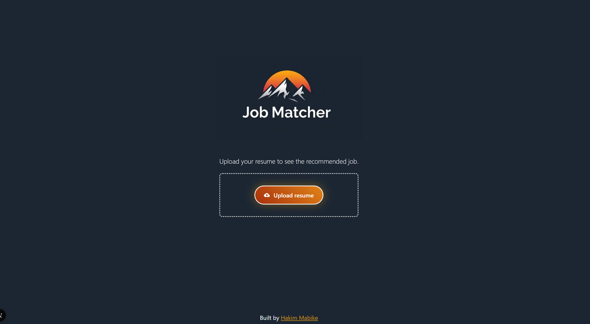

# Job Matching Platform

A AI-powered career analysis platform that helps users analyse their CVs to identify skill gaps, predict salaries, suggest an optimum career path and provide personalised action plans for career development.

## 🖼️ Screenshot




## 🌐 Demo & Live Site

- **🎥 Recording:** [Watch the demo recording](https://www.loom.com/share/8caad20c11db4f22882d23d492ae3e47?sid=cc866cbb-fba4-433d-b5e8-8b8c4ce6d263)
- **🚀 Live Website:** [Visit the Job Matching Platform](https://job-matcher-bay.vercel.app)


## 🚀 Features

### Core Analysis
- **AI-Powered Resume Analysis**: Uses Mistral AI to analyze CV content and extract key information
- **Career Path Matching**: Identifies the most suitable tech career based on skills, education, and experience
- **Match Percentage Scoring**: Provides detailed scoring across technical, experience, and education dimensions
- **Salary Predictions**: Estimates potential salaries across entry, mid, and senior levels

### Comprehensive Analysis Sections
- **📊 Overview**: Career match percentage, salary predictions, and career path explanations
- **💪 Strengths & Skills**: Highlights key strengths, technical skills, and experience highlights
- **📈 Market Analysis**: Job market demand, growth rates, competition levels, and remote opportunities
- **📚 Learning Resources**: Curated learning materials with ratings, difficulty levels, and skill focus
- **🏢 Top Companies**: Recommended companies actively hiring with culture and benefits information
- **🎯 Cultural Fit**: Work style preferences, environment fit, and cultural compatibility scores
- **🚀 Action Plan**: Personalized 3-phase career development roadmap with quick wins

## 🛠 Tech Stack

### Frontend
- **[Next.js 15.5.3](https://nextjs.org/)** - React framework with App Router
- **[React 18.3.1](https://reactjs.org/)** - UI library
- **[TypeScript 5](https://www.typescriptlang.org/)** - Type safety
- **[Tailwind CSS 4](https://tailwindcss.com/)** - Styling framework
- **[Radix UI](https://www.radix-ui.com/)** - Accessible component primitives
- **[Lucide React](https://lucide.dev/)** - Icon library

### Backend & AI
- **[Mistral AI](https://docs.mistral.ai/)** - AI-powered resume analysis
- **[PDF.js](https://mozilla.github.io/pdf.js/)** - PDF parsing and text extraction
- **[Vercel AI SDK](https://sdk.vercel.ai/)** - AI integration and streaming

### Additional Libraries
- **[Material-UI](https://mui.com/)** - UI components
- **[React Icons](https://react-icons.github.io/react-icons/)** - Icon components
- **[Formidable](https://github.com/node-formidable/formidable)** - File upload handling
- **[Axios](https://axios-http.com/)** - HTTP client

## 📁 Project Structure

```
src/
├── app/
│   ├── api/
│   │   └── matcher/
│   │       └── route.ts          # Mistral AI API endpoint
│   ├── components/
│   │   ├── ui/                   # Reusable UI components
│   │   │   ├── badge.tsx
│   │   │   ├── card.tsx
│   │   │   └── tabs.tsx
│   │   ├── CulturalFit.tsx       # Cultural fit analysis component
│   │   ├── JobMarketDemand.tsx   # Market analysis component
│   │   ├── JobMatcher.tsx        # Main results display component
│   │   ├── LearningResources.tsx # Learning resources component
│   │   ├── MatchPercentage.tsx   # Match percentage display
│   │   ├── ResumeAnalyser.tsx    # Main analysis orchestrator
│   │   ├── ResumeUploader.tsx    # PDF upload component
│   │   ├── StrengthsSkills.tsx   # Strengths and skills display
│   │   └── TopCompanies.tsx      # Company recommendations
│   ├── styles/                   # CSS modules for styling
│   ├── layout.tsx                # App layout
│   └── page.tsx                  # Home page
├── lib/
│   ├── analysisUtils.ts          # Analysis parsing utilities
│   ├── mockData.ts              # Mock data for testing
│   └── utils.ts                 # General utilities
└── types/
    └── analysis.ts              # TypeScript type definitions
```

## 🎯 Key Components

### ResumeAnalyser
The main orchestrator component that handles the entire analysis flow:
- Manages file upload and PDF parsing
- Coordinates with Mistral AI API
- Provides demo mode with mock data
- Handles loading states and error management

### JobMatcher
The comprehensive results display component featuring:
- **Tabbed Interface**: 7 different analysis sections
- **Overview Tab**: Match percentage, salary predictions, career explanations
- **Strengths Tab**: Skills analysis and experience highlights
- **Market Tab**: Job market demand and growth insights
- **Resources Tab**: Curated learning materials
- **Companies Tab**: Top hiring companies with culture fit
- **Culture Tab**: Work style and environment preferences
- **Action Plan Tab**: Personalized career development roadmap

### ResumeUploader
Handles PDF file uploads with:
- Drag-and-drop functionality
- PDF text extraction using PDF.js
- Error handling and validation
- Loading states and user feedback

## 🔧 API Integration

### Mistral AI Analysis
The `/api/matcher` endpoint provides comprehensive career analysis:
- **Career Matching Logic**: Prioritizes education, skills, and experience
- **Comprehensive Output**: Returns detailed JSON with all analysis sections
- **Streaming Response**: Real-time analysis updates
- **Error Handling**: Robust error management and fallbacks

### Analysis Features
- **Educational Background Matching**: Maps degrees to suitable tech roles
- **Skills-Based Matching**: Analyses technical skills for role alignment
- **Experience-Based Matching**: Considers work history for career suggestions
- **Market Data Integration**: Current job market insights
- **Cultural Fit Analysis**: Personality and work style assessment

## 🚀 Getting Started

### Prerequisites
- Node.js 18+ 
- npm or yarn
- Mistral AI API key

### Installation
1. Clone the repository:
   ```bash
   git clone <repository-url>
   cd job_matcher
   ```

2. Install dependencies:
   ```bash
   npm install
   ```

3. Set up environment variables:
   ```bash
   # Create .env.local file
   MISTRAL_API_KEY=your_mistral_api_key_here
   ```

4. Start the development server:
   ```bash
   npm run dev
   ```

5. Open [http://localhost:3000](http://localhost:3000) in your browser

## 📊 Analysis Output

The platform generates comprehensive analysis including:

### Core Metrics
- **Match Percentage**: Overall, technical, experience, and education scores
- **Salary Predictions**: Entry, mid, and senior level salary ranges
- **Career Recommendations**: Primary and alternative career paths

### Detailed Insights
- **Skills Analysis**: Highlighted skills, gaps, and improvement areas
- **Market Intelligence**: Demand scores, growth rates, and competition levels
- **Company Recommendations**: Top hiring companies with culture fit
- **Learning Path**: Curated resources with difficulty and duration
- **Action Plan**: 3-phase development roadmap with quick wins

## 🎨 UI/UX Features

- **Responsive Design**: Mobile-first approach with Tailwind CSS
- **Modern Interface**: Clean, professional design with smooth animations
- **Accessibility**: Built with Radix UI for screen reader compatibility
- **Loading States**: Comprehensive loading indicators and error handling
- **Interactive Elements**: Hover effects, transitions, and micro-interactions

## 🔒 Security & Privacy

- **Client-Side Processing**: PDF parsing happens in the browser
- **No Data Storage**: Resumes are not stored on servers
- **API Key Security**: Environment variable configuration
- **Error Handling**: Comprehensive error management without data exposure

## 🚀 Deployment

The application is optimized for deployment on Vercel:
- **Edge Runtime**: API routes use edge runtime for performance
- **Static Generation**: Optimized for production builds
- **Environment Variables**: Secure API key management


## ❓ Issues & Support

If you encounter any issues, have questions, or need support, feel free to reach out to me directly on [LinkedIn](https://www.linkedin.com/in/hakim-mabike-643848214). I'm happy to help!


## 👨‍💻 Author

**Hakim Mabike**
- LinkedIn: [https://www.linkedin.com/in/hakim-mabike-643848214](https://www.linkedin.com/in/hakim-mabike-643848214)

---
